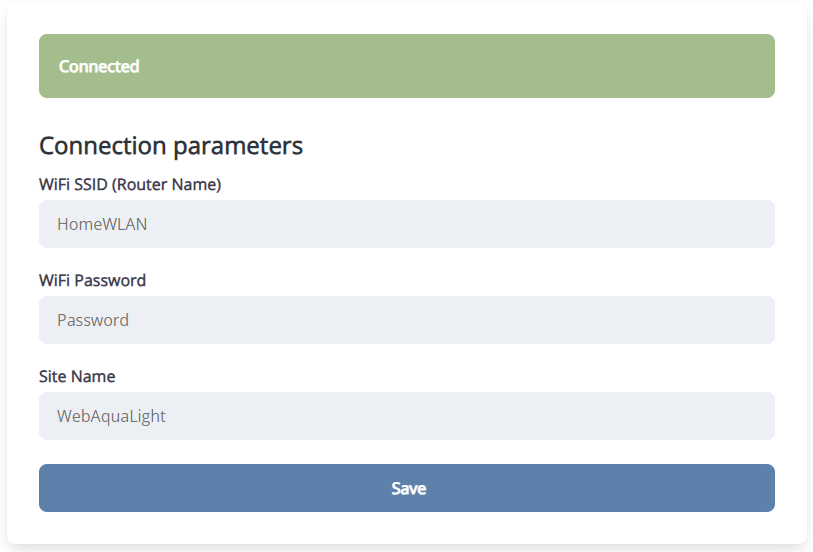
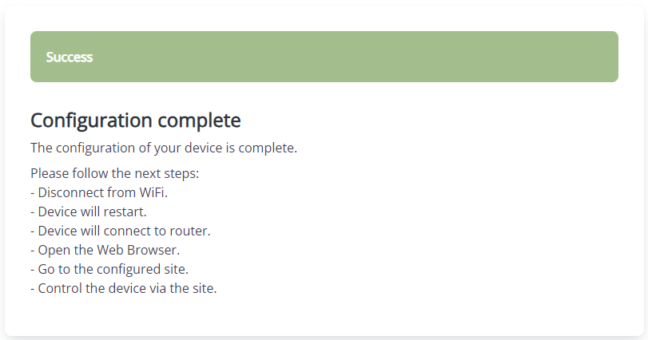
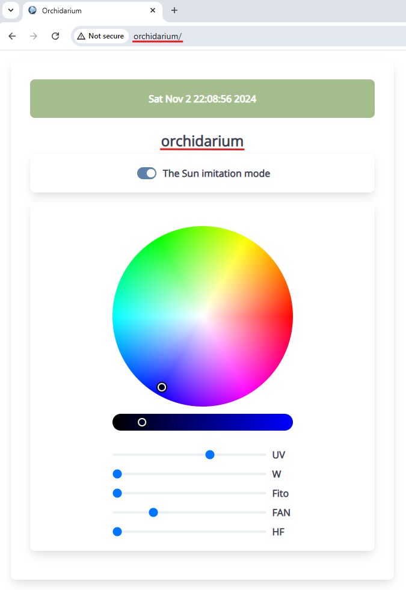

# Orchidarium Project

## Requirements
1. [Python 3.x](https://www.python.org)
2. [Git](https://git-scm.com)
3. [Visual Studio Code](https://code.visualstudio.com)

## Installation of ESP IDF SDK and tools
1. Run the [install batch script](./utils/install-esp-idf.bat). If the script is run for the first time, it will create the "paths-win-tools.bat" file with a set of environment variables.
2. Open the "paths-win-tools.bat" and edit it to set the paths for the required tools. You should install all the tools if it is not done before.
3. Run the [install batch script] again (./utils/install-esp-idf.bat). It will check for all the required tools and install the ESP IDF.
4. Run the [launch batch script](./utils/launch-vs-code.bat). It will launch the environment and allow the further development of the project.
5. Edit the "parameters.bat" file (which will be created by the install script) and set the COM port and the baud rate for programming.

## Tips
1. For comfort development you should install the following VS Code extensions: C/C++, CMake, Task Runner. They will simplify the process.
2. To build/flash/monitor the project just run the appropriate task in VS Code.
3. For more information the [ESP32 IDF help](https://docs.espressif.com/projects/esp-idf/en/stable/esp32/get-started/index.html) can be used as a reference.

## How to work with device
1. At the first time the device will start as a WiFi access point with the name "WIFI-XXXXXXXXXXXX", where the "XXXXXXXXXXXX" is the serial number of the device. The device will indicate the periodic red color fade on the LED strip.
2. Using the mobile phone or the PC connect to the access point "WIFI-XXXXXXXXXXXX", the password is "0123456789".
3. The following web page should be opened in your web browser automatically. If it is not opened automatically try to open http://192.168.4.1 in your browser or click on the WiFi message in the tray.

4. Enter the appropriate fields in the configuration form and click the "Save" button. The following web page with the next steps will be shown.

5. During connection to the router the periodic blue color fade will be indicated on the LED strip. After a successful connection to the router, the rotating rainbow will be indicated on the LED strip.
6. After the device is connected to the router open the browser and enter the site name you entered in the configuration web page. The following web page will be shown and you can control the color and brightness of the LED strip. You can also enable the Sun imitation mode. In this mode, the device synchronizes the date/time via the Internet, calculates the sunrise/sundown times, and sets the color/brightness according to the Sun's position in the sky.

7. For Android devices, the "mDNS Discovery" application can be used to discover the device in the network and avoid the knowledge of the exact device IP address. During the discovery process, the application will show the site name entered in the configuration web page.

## Resources
- The HTTP server with WebSockets [article](https://lujji.github.io/blog/esp-httpd).
- The captive portal [basics](https://en.wikipedia.org/wiki/Captive_portal).
- A minimal and themeable css [toolkit](https://siimple.xyz).
- Modular, design-conscious color picker [widget](https://iro.js.org) for JavaScript.
- A JavaScript charting [library](http://smoothiecharts.org) for streaming sata.
- The Chrome as a local web server [tips](./docs/chrome-devtools.md).